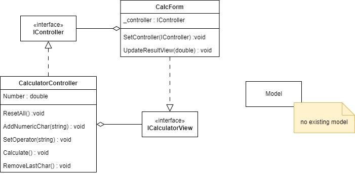

# Forms Beispiel - MVC

## Grundlagen
Model View Controller (MVC, englisch für Modell-Ansicht-Steuerung) ist ein Muster zur Unterteilung einer Software in die drei Komponenten Datenmodell (englisch model), Ansicht (englisch view) und Programmsteuerung (englisch controller). Das Muster kann sowohl als Architekturmuster als auch als Entwurfsmuster eingesetzt werden. Ziel des Musters ist ein flexibler Programmentwurf, der eine spätere Änderung oder Erweiterung erleichtert und eine Wiederverwendbarkeit der einzelnen Komponenten ermöglicht. Es ist dann zum Beispiel möglich, eine Anwendung zu schreiben, die dasselbe Modell nutzt und es dann für Windows, Mac, Linux oder für das Internet zugänglich macht. Die Umsetzungen nutzen dasselbe Modell, nur Controller und View müssen dabei jeweils neu implementiert werden.

Das MVC-Konzept wurde 1979 zunächst für Benutzeroberflächen in Smalltalk durch Trygve Reenskaug beschrieben (Seeheim-Modell), der damals an Smalltalk im Xerox PARC arbeitete. Es gilt mittlerweile aber als De-facto-Standard für den Grobentwurf vieler komplexer Softwaresysteme, teils mit Differenzierungen und oftmals mehreren jeweils nach dem MVC-Muster aufgeteilten Modulen.

Quelle: [MVC](https://de.wikipedia.org/wiki/Model_View_Controller)

## Umsetzung in Forms Beispiel

